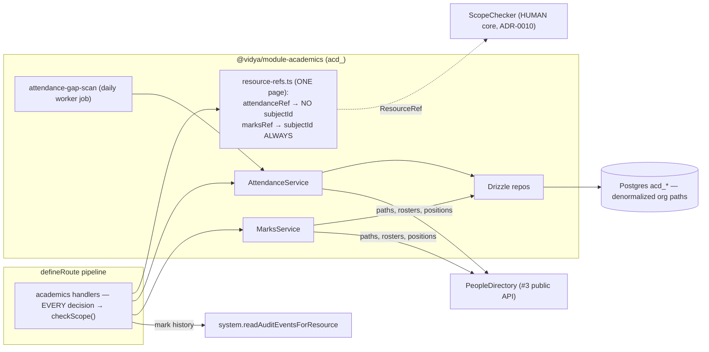
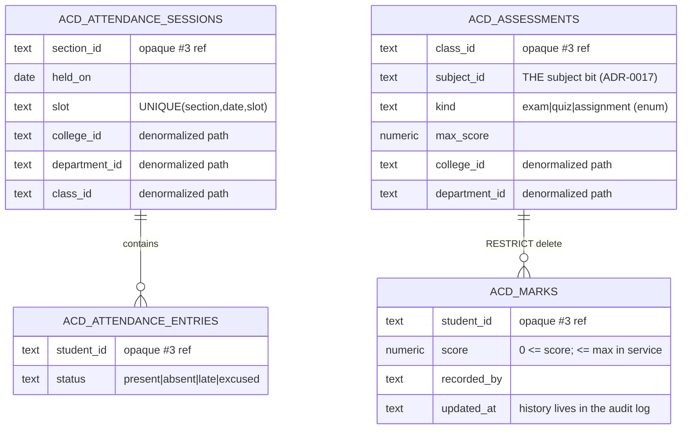

# Academics flows

## Component view



## Marksheet entry (bulk) with the grade-change trail

```mermaid
sequenceDiagram
    autonumber
    participant T as Subject teacher (session)
    participant P as Pipeline (teacher role gate)
    participant H as marks-enter handler
    participant SC as ScopeChecker (HUMAN)
    participant MS as MarksService
    participant DIR as PeopleDirectory (#3)
    participant DB as acd_marks
    participant AU as Audit (append-only)

    T->>P: PUT /assessments/{id}/marks {entries[]}
    P->>H: validated body
    H->>H: marksRef(assessment) — class path + subjectId FROM THE ROW
    H->>SC: check(principal, "update", marksRef)
    alt not this subject's teacher
        SC-->>H: denied → 403 (nothing read or written)
    else granted
        H->>MS: enterMarks(assessment, entries)
        MS->>MS: validate ALL: score ≤ maxScore, no duplicates
        MS->>DIR: studentPosition(each) — enrolled in THIS class?
        alt any invalid
            MS-->>H: InvalidEntriesError → 422 {per-entry reasons} (no writes)
        else
            MS->>DB: upsert in one tx → per-entry diffs {before, after}
            H->>AU: academics.marks-entered {actor, changes: diffs (≤100)}
            H-->>T: 200 {created, updated, unchanged}
        end
    end
    Note over AU: corrections (PATCH /marks/{id}) audit the same way;<br/>GET /marks/{id}/history reassembles the full trail
```

## Attendance session

```mermaid
sequenceDiagram
    autonumber
    participant CT as Class teacher (session)
    participant H as attendance-record handler
    participant SC as ScopeChecker (HUMAN)
    participant AS as AttendanceService
    participant DIR as PeopleDirectory (#3)

    CT->>H: POST /attendance/sessions {sectionId, date, entries[]}
    H->>DIR: sectionPath(sectionId) → full path (404 if unknown)
    H->>SC: check(principal, "create", attendanceRef(path)) — NO subjectId
    Note over SC: teacher role would be DENIED here (non-subject write);<br/>class_teacher of this class is GRANTED
    H->>AS: recordSession(...)
    AS->>DIR: sectionRoster — every entry must be on the LIVE roster
    AS->>AS: stamp org path onto the session; insert session+entries in one tx
    H-->>CT: 201 (audited with status counts)
```

## ER (acd_)


