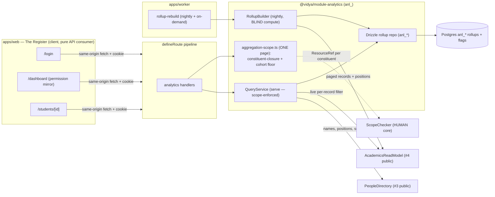
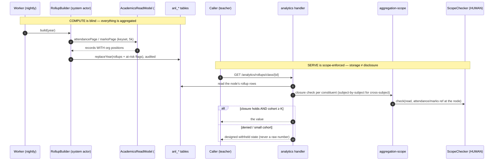
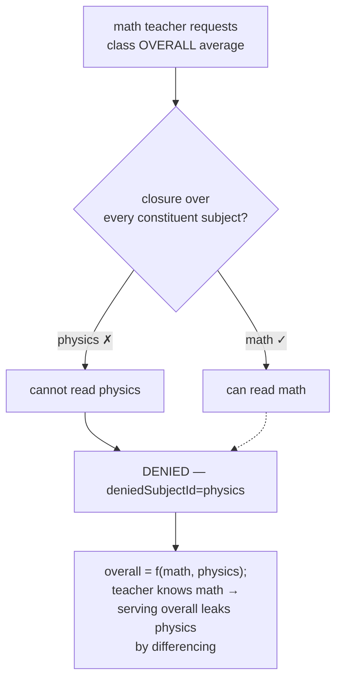
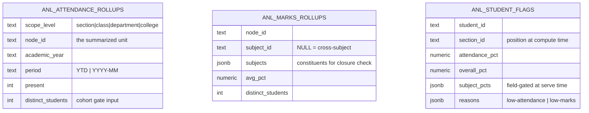

# Analytics flows

## Component view

## Nightly rebuild (blind compute) → scope-enforced serve

## The cross-subject wall (why "class overall" is denied to a subject teacher)

## ER (anl_) — precomputed rollups the module owns

No FK to `acd_*` or `ppl_*` — these are owned, derived rows keyed by opaque
cross-module ids; a full rebuild regenerates them from #4's read model.
