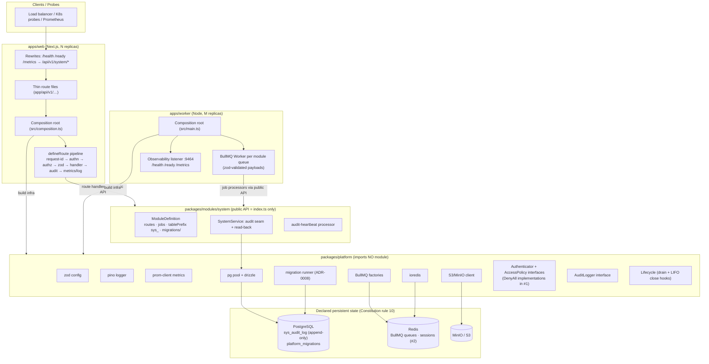

# Component diagram

**Legend of the enforcement seams:** route files may import only the
composition root; composition roots are the only importers of modules;
platform imports no module; module internals (incl. `sys_*` schema) are
unreachable from outside — by lint (ADR-0006) and by package `exports`.
