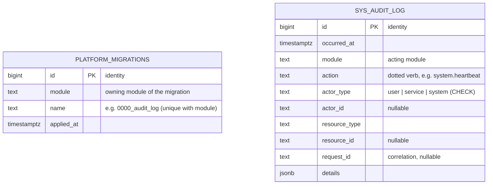

# Database diagram & table-ownership convention

No FK between them — they belong to different owners and audit rows must
outlive anything they reference.

## Ownership convention (Constitution rule 2)

| Prefix | Owner | Notes |
|---|---|---|
| `sys_` | `@vidya/module-system` | `sys_audit_log` is append-only: BEFORE UPDATE/DELETE row triggers and a BEFORE TRUNCATE statement trigger raise exceptions in the database itself. |
| `platform_` | platform migration runner only | Single table `platform_migrations` (journal), exempted by ADR-0008. Modules may never reference it (CI-checked). |
| *(future)* e.g. `idn_`, `att_` | one module each | Declared as `tablePrefix` in the ModuleDefinition; `scripts/check-table-ownership.ts` fails CI on any DDL/`pgTable()` outside the owner's prefix or any cross-prefix mention. |

Cross-module data access happens through the owning module's service API,
never through SQL — schema objects are module-internal and unimportable.
