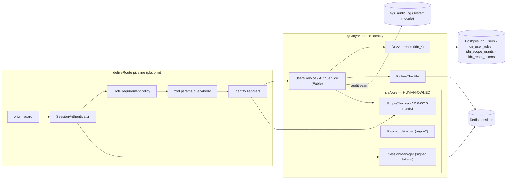
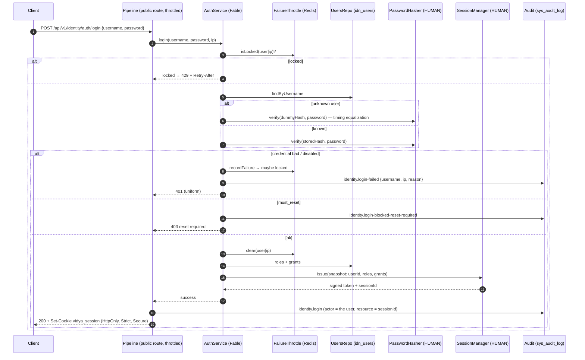
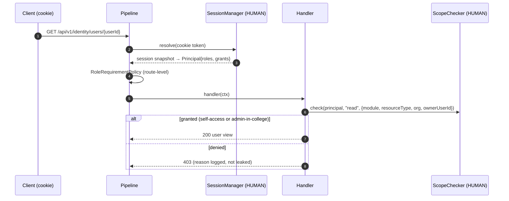
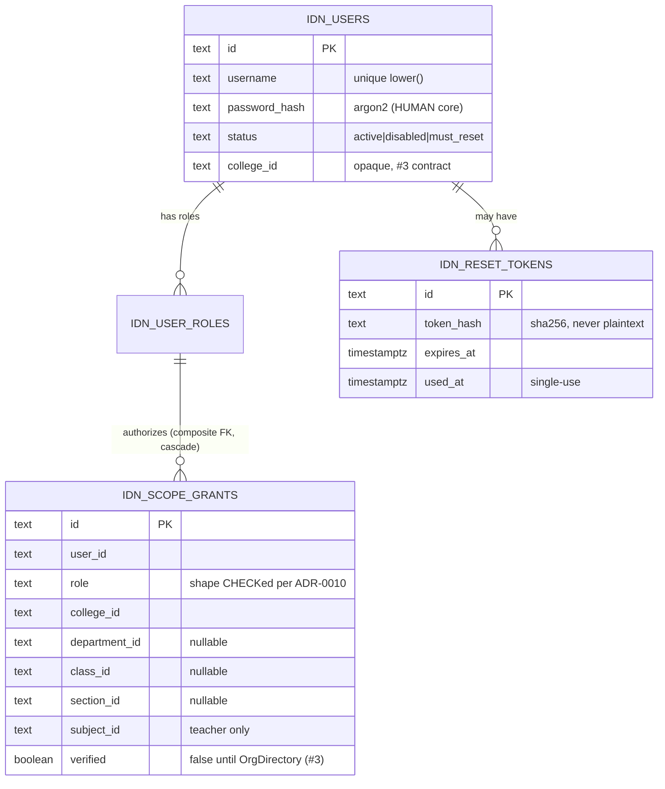

# Identity flows

## Component view

## Login sequence

## Authenticated request with a record-level decision

## Database additions (idn_)

Sessions are not a table — they live in Redis (SessionManager).
