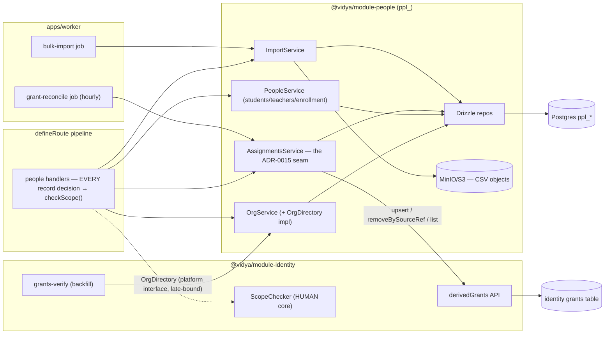
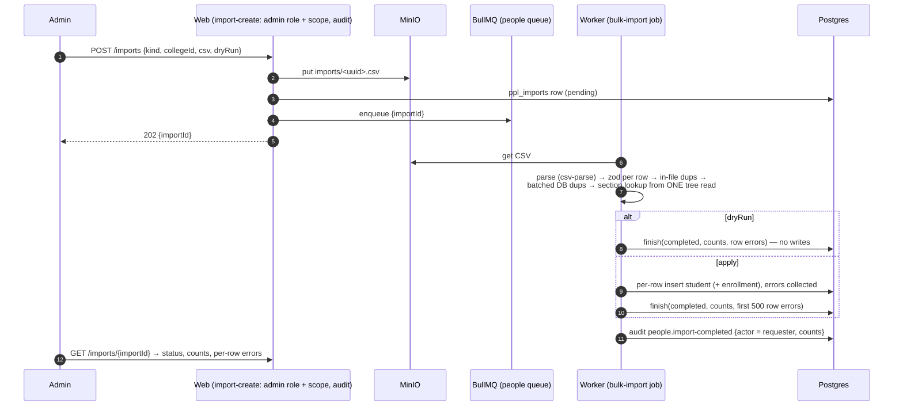
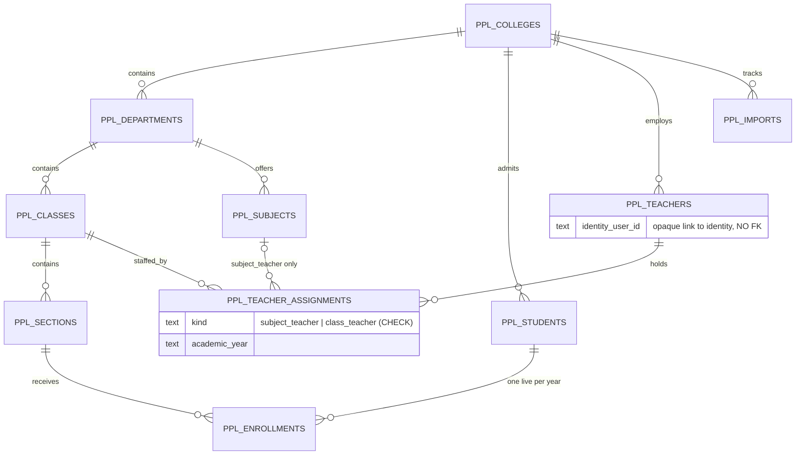

# People-module flows

## Component view



## Assignment → derived grant → live authority

```mermaid
sequenceDiagram
    autonumber
    participant A as Admin (session)
    participant P as Pipeline (admin role + scope check @ class path)
    participant AS as AssignmentsService (people)
    participant DG as identity.derivedGrants
    participant SM as SessionManager (HUMAN)
    participant AU as Audit

    A->>P: POST /teachers/{id}/assignments {class, subject, kind}
    P->>AS: create(...)
    AS->>AS: write ppl_teacher_assignments row
    AS->>DG: upsert({userId, role, class-level org, subject, sourceRef})
    alt identity call fails
        AS->>AS: DELETE the row (compensation)
        AS-->>P: error → request fails (no silent drift)
    else
        DG->>DG: ensure role membership; write grant (source=derived, verified=true)
        DG->>SM: invalidateAllForUser(teacher)
        DG->>AU: identity.grant-derived {sourceRef}
        P->>AU: people.assignment-created
        P-->>A: 201
    end
    Note over SM: the teacher's NEXT login carries the new grant —<br/>no session ever holds stale authority (#2 invariant)
```

## Bulk import



## ER (ppl_)



All deletes up the tree are RESTRICT; enrollment cascades from student.
Derived grants live in the identity module keyed by
`source_ref = people:assignment:<id>` (ADR-0015).
