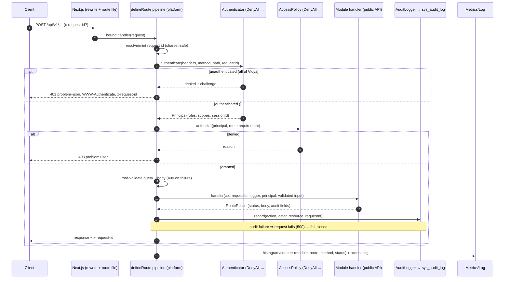

# Request-through-middleware sequence

A state-changing request under the full pipeline (authenticated case shows
the #2 wiring; in #1 the DenyAll authenticator short-circuits at step 3
with 401).

GET routes skip the audit step; public routes (`system.health/ready/metrics`
only) skip steps 4–7 by explicit, justified declaration in their RouteSpec.
